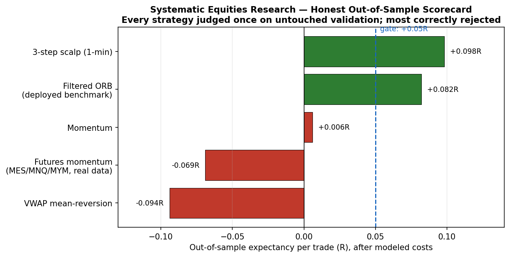

# Systematic Trading Research Platform (US Equities)

A from-scratch quantitative research platform for designing, backtesting, and paper-deploying
intraday systematic strategies — engineered around one principle: **methodological rigor over
P&L.** It is built to *disprove its own ideas* before trusting them, and it does: across six
strategy families, it rejected five with real out-of-sample metrics and deployed only a
measured benchmark to paper.

> **Research / paper-trading only.** No live capital. The broker client is hard-locked to paper endpoints.

**Tools & libraries:** Python (pandas, NumPy) · Alpaca API (equities data + paper execution) ·
GitHub Actions (CI + serverless scheduling) · Slack API (monitoring) · YAML config · unit tests.

---



*Every strategy is judged once on untouched out-of-sample data against a pre-registered gate. The platform's value is the discipline to reject its own ideas — five of six here.*

## Results at a glance (real, out-of-sample, after modeled costs)

Every strategy below ran through the **same pre-registered gate** (net expectancy in R, profit
factor, walk-forward folds, cost sensitivity), judged **once** on an untouched validation window:

| Strategy | Out-of-sample result | Verdict |
|---|---|---|
| Filtered Opening-Range Breakout (regime + relative-strength) | ~150 val trades, **+0.082R**, PF **1.289**, walk-forward **3/4** folds | Deployed to paper as a measured benchmark (flagged unconfirmed) |
| VWAP mean-reversion | 1,948 val trades, **−0.094R**, PF 0.853, 0/3 quarters+ | Rejected |
| Momentum continuation | 604 val trades, **+0.006R**, PF 1.136 (below gate) | Rejected |
| 3-step break-and-retest scalp (1-min) | 2,070 val trades, **+0.098R**, PF 1.172; bootstrap 90% CI **[+0.042, +0.153]** | Weak pass — flagged fragile |
| Momentum on **real index futures** (MES/MNQ/MYM, Databento) | 314 trades, **−0.069R**, PF 0.938, 1/4 folds | Rejected — edge did not survive real costs |
| Diversified time-series momentum (21 CME markets) | OOS Sharpe **−0.27**, −4.4%/yr, maxDD −49.6% | Rejected on this window |

**The measurable impact:** the pipeline caught a strategy that looked strong on an equity proxy
(**+0.263R** in-sample) and proved it was a **money-loser on real futures data with real costs**
— i.e., it prevented deploying a losing strategy *before* a data-feed subscription or live risk.
That "don't-fool-yourself" catch is the entire point.

## What I built, how, and what happened
- **Engineered a no-lookahead, event-driven backtest engine** (pandas/NumPy): signals never see
  the bar they trade on; stops checked before targets; gaps fill on the unfavorable side;
  fixed-fractional risk sizing. Validated with offline unit tests.
- **Built a pre-registered research harness** with train/validation separation, multi-fold
  walk-forward, bootstrap significance testing, per-regime breakdowns, and cost-sensitivity
  sweeps — the guardrails that separate real edges from over-fit noise.
- **Integrated real market data** from Alpaca (equities) and Databento (CME futures, roll-adjusted
  continuous series), with a pre-flight cost estimator that caps spend before any download.
- **Automated the full pipeline serverlessly** on GitHub Actions: pre-market briefing, entry
  session, end-of-day reconciliation, and weekly research sweeps — with Slack monitoring, a
  self-rendering dashboard, server-side bracket orders, hard risk caps, and a paper-lock plus an
  arming kill-switch wired to research verdicts.

## Architecture
```
GitHub Actions (scheduler) -> Signal layer -> No-lookahead backtest engine -> Risk engine
        |                                                                          |
   Slack alerts + dashboard  <-  Alpaca paper (code-locked) / Databento data  <----+
```

## Repository layout
- `src/strategies/` — signal generators (ORB, VWAP-reversion, momentum, filters)
- `src/backtest/` — engine, metrics, research harness, walk-forward, futures + TSMOM
- `src/live/` — paper execution, risk engine, pre-market, dashboard
- `tests/` — offline unit tests (engine, filters, gate, cost model)
- `reports/` — timestamped research reports (the full audit trail)

---
*A self-directed study in quantitative research methodology and trading-systems engineering:
reproducibility, cost realism, and intellectual honesty about what does and does not work.*
